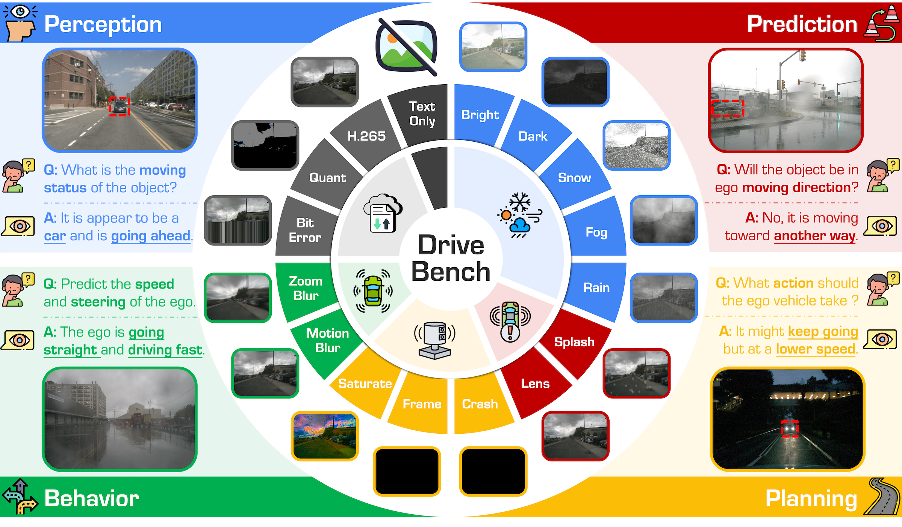
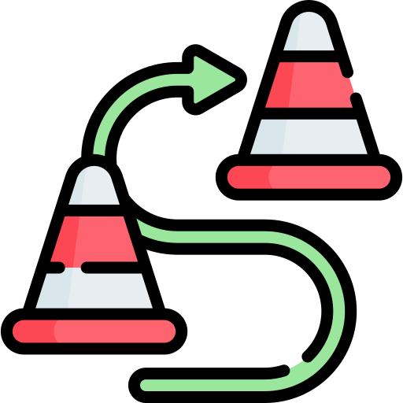
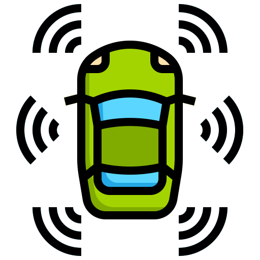
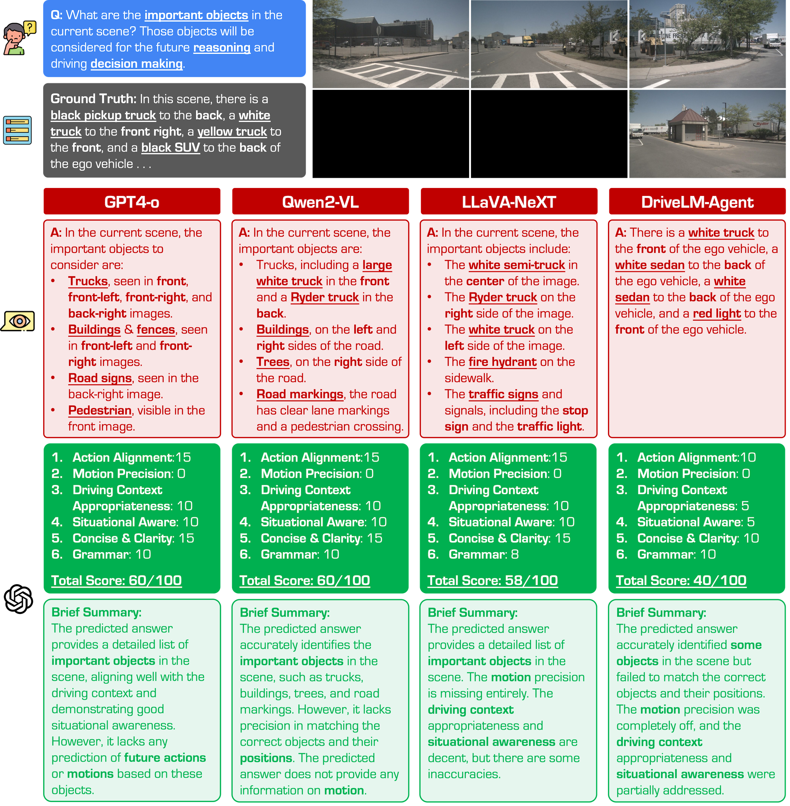
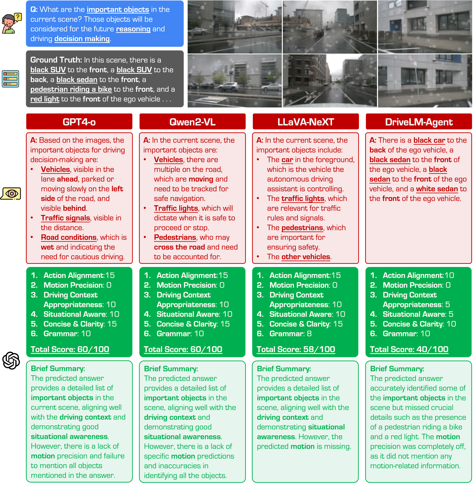

<p align="right">English | <a href="./README_CN.md">简体中文</a></div> 


<p align="center">
  <h2 align="center">  
    
    <strong>Are VLMs Ready for Autonomous Driving?<br>An Empirical Study from the Reliability, Data, and Metric Perspectives</strong>
  </h2>

  <p align="center">
      <a href="https://daniel-xsy.github.io/" target='_blank'>Shaoyuan Xie</a><sup>1</sup>&nbsp;&nbsp;&nbsp;&nbsp;
      <a href="https://ldkong.com/" target='_blank'>Lingdong Kong</a><sup>2,3</sup>&nbsp;&nbsp;&nbsp;&nbsp;
      <a href="https://scholar.google.com/citations?user=kMui170AAAAJJ&hl=en" target='_blank'>Yuhao Dong</a><sup>2,4</sup>&nbsp;&nbsp;&nbsp;&nbsp;
      <a href="https://scholar.google.com/citations?user=dgYJ6esAAAAJJ&hl=en" target='_blank'>Chonghao Sima</a><sup>2,6</sup><br>
      <a href="https://scholar.google.com/citations?user=QDXADSEAAAAJJ&hl=en" target='_blank'>Wenwei Zhang</a><sup>2</sup>&nbsp;&nbsp;&nbsp;&nbsp;
      <a href="https://ics.uci.edu/~alfchen/" target='_blank'>Qi Alfred Chen</a><sup>1</sup>&nbsp;&nbsp;&nbsp;&nbsp;
      <a href="https://liuziwei7.github.io/" target='_blank'>Ziwei Liu</a><sup>4</sup>&nbsp;&nbsp;&nbsp;&nbsp;
      <a href="https://scholar.google.com/citations?user=lSDISOcAAAAJJ&hl=en" target='_blank'>Liang Pan</a><sup>2</sup>
    </br></br>
  <sup>1</sup>UC, Irvine&nbsp;&nbsp;&nbsp;&nbsp;
  <sup>2</sup>Shanghai AI Laboratory&nbsp;&nbsp;&nbsp;&nbsp;
  <sup>3</sup>NUS&nbsp;&nbsp;&nbsp;&nbsp;
  <sup>4</sup>NTU&nbsp;&nbsp;&nbsp;&nbsp;
  <sup>5</sup>HKU
  </p>
</p>

<p align="center">
  <a href="https://arxiv.org/abs/2501.04003" target='_blank'>
    
  </a>&nbsp;
  <a href="https://drive-bench.github.io/" target='_blank'>
    
  </a>&nbsp;
  <a href="https://huggingface.co/datasets/drive-bench/arena" target='_blank'>
    
  </a>&nbsp;
  <a >
    
  </a>&nbsp;
  <a href="https://github.com/drive-bench/toolkit" target="_blank">
    
  </a>
</p>


## About

|  |
|:-:|

- This work introduces :blue_car: **DriveBench**, a benchmark dataset designed to evaluate VLM reliability across **17 settings** (clean, corrupted, and text-only inputs), encompassing **19,200 frames**, **20,498 question-answer pairs**, **three question types**, **four mainstream driving tasks**, and **a total of 12 popular VLMs**. 
- Our findings reveal that VLMs often generate plausible responses derived from general knowledge or textual cues rather than true visual grounding, especially under degraded or missing visual inputs. This behavior, concealed by **dataset imbalances** and **insufficient evaluation metrics**, poses significant risks in safety-critical scenarios like autonomous driving. 

### :books: Citation
If you find this work helpful for your research, please kindly consider citing our paper:

```
@inproceedings{xie2025drivebench,
  author  = {Xie, Shaoyuan and Kong, Lingdong and Dong, Yuhao and Sima, Chonghao and Zhang, Wenwei and Chen, Qi Alfred and Liu, Ziwei and Pan, Liang},
  title   = {Are VLMs Ready for Autonomous Driving? An Empirical Study from the Reliability, Data, and Metric Perspectives},
  journal = {Proceedings of the IEEE/CVF International Conference on Computer Vision},
  year    = {2025},
}
```


## :memo: Updates
- \[2025.06\] - Our paper has been accepted to **ICCV 2025**! :tada:
- \[2025.04\] - We are hosting the **RoboSense 2025 Competition**! :checkered_flag: Visit the [competition homepage](https://robosense2025.github.io/) for details and participation.
- \[2025.01\] - The evaluation data can be accessed at our [HuggingFace Dataset Card](https://huggingface.co/datasets/drive-bench/arena). :hugs:
- \[2025.01\] - Introducing the :blue_car: **DriveBench** project! For more details, kindly refer to our [Project Page](https://drive-bench.github.io/) and [Preprint](https://arxiv.org/abs/2501.04003). :rocket:


# Table of Contents
- [Benchmark Comparison](#bar_chart-benchmark-comparison)
- [Installation](#gear-installation)
- [Data Preparation](#hotsprings-data-preparation)
- [Getting Started](#rocket-getting-started)
- [Benchmark Results](#aerial_tramway-benchmark-results)
  - [Benchmark Configuration](#benchmark-configuration)
  - [Benchmark Study](#benchmark-study)
  - [Robustness Analysis](#robustness-analysis)
- [License](#license)
- [Acknowledgments](#acknowledgments)


# :bar_chart: Benchmark Comparison

<table>
<thead>
<tr>
<th rowspan="2">Benchmark</th>
<th rowspan="2"><span>Perception</span></th>
<th rowspan="2"><span>Prediction</span></th>
<th rowspan="2"><span>Behavior</span></th>
<th rowspan="2"><span>Planning</span></th>
<th rowspan="2"><span>Robustness</span></th>
<th>Frames</th>
<th>QA</th>
<th rowspan="2">Logic</th>
<th rowspan="2">Evaluation Metrics</th>
</tr>
<tr>
<th>(Test)</th>
<th>(Test)</th>
</tr>
</thead>
<tbody>
<tr>
<td></td><td></td><td></td><td></td><td></td><td></td><td></td><td></td><td></td><td></td>
</tr>
<tr>
<td>BDD-X</td>
<td><span style="color: rgb(0, 176, 80);">✔</span></td>
<td><span style="color: rgb(192, 0, 0);">✘</span></td>
<td><span style="color: rgb(192, 0, 0);">✘</span></td>
<td><span style="color: rgb(192, 0, 0);">✘</span></td>
<td><span style="color: rgb(192, 0, 0);">✘</span></td>
<td>-</td>
<td>-</td>
<td>None</td>
<td>Language</td>
</tr>
<tr>
<td>BDD-OIA</td>
<td><span style="color: rgb(0, 176, 80);">✔</span></td>
<td><span style="color: rgb(192, 0, 0);">✘</span></td>
<td><span style="color: rgb(0, 176, 80);">✔</span></td>
<td><span style="color: rgb(192, 0, 0);">✘</span></td>
<td><span style="color: rgb(192, 0, 0);">✘</span></td>
<td>-</td>
<td>-</td>
<td>None</td>
<td>F1 Score</td>
</tr>
<tr>
<td>nuScenes-QA</td>
<td><span style="color: rgb(0, 176, 80);">✔</span></td>
<td><span style="color: rgb(192, 0, 0);">✘</span></td>
<td><span style="color: rgb(192, 0, 0);">✘</span></td>
<td><span style="color: rgb(192, 0, 0);">✘</span></td>
<td><span style="color: rgb(192, 0, 0);">✘</span></td>
<td>36,114</td>
<td>83,337</td>
<td>None</td>
<td>Acc</td>
</tr>
<tr>
<td>Talk2Car</td>
<td><span style="color: rgb(0, 176, 80);">✔</span></td>
<td><span style="color: rgb(192, 0, 0);">✘</span></td>
<td><span style="color: rgb(192, 0, 0);">✘</span></td>
<td><span style="color: rgb(0, 176, 80);">✔</span></td>
<td><span style="color: rgb(192, 0, 0);">✘</span></td>
<td>~1.8k</td>
<td>2,447</td>
<td>None</td>
<td>-</td>
</tr>
<tr>
<td>nuPrompt</td>
<td><span style="color: rgb(0, 176, 80);">✔</span></td>
<td><span style="color: rgb(192, 0, 0);">✘</span></td>
<td><span style="color: rgb(192, 0, 0);">✘</span></td>
<td><span style="color: rgb(192, 0, 0);">✘</span></td>
<td><span style="color: rgb(192, 0, 0);">✘</span></td>
<td>~36k</td>
<td>~6k</td>
<td>None</td>
<td>AMOTA</td>
</tr>
<tr>
<td>DRAMA</td>
<td><span style="color: rgb(0, 176, 80);">✔</span></td>
<td><span style="color: rgb(192, 0, 0);">✘</span></td>
<td><span style="color: rgb(192, 0, 0);">✘</span></td>
<td><span style="color: rgb(0, 176, 80);">✔</span></td>
<td><span style="color: rgb(192, 0, 0);">✘</span></td>
<td>-</td>
<td>~14k</td>
<td>Chain</td>
<td>Language</td>
</tr>
<tr>
<td>Rank2Tel</td>
<td><span style="color: rgb(0, 176, 80);">✔</span></td>
<td><span style="color: rgb(192, 0, 0);">✘</span></td>
<td><span style="color: rgb(192, 0, 0);">✘</span></td>
<td><span style="color: rgb(0, 176, 80);">✔</span></td>
<td><span style="color: rgb(192, 0, 0);">✘</span></td>
<td>-</td>
<td>-</td>
<td>Chain</td>
<td>Accuracy, Language</td>
</tr>
<tr>
<td>DirveMLLM</td>
<td><span style="color: rgb(0, 176, 80);">✔</span></td>
<td><span style="color: rgb(192, 0, 0);">✘</span></td>
<td><span style="color: rgb(192, 0, 0);">✘</span></td>
<td><span style="color: rgb(192, 0, 0);">✘</span></td>
<td><span style="color: rgb(192, 0, 0);">✘</span></td>
<td>880</td>
<td>-</td>
<td>None</td>
<td>Acc</td>
</tr>
<tr>
<td>DriveVLM</td>
<td><span style="color: rgb(0, 176, 80);">✔</span></td>
<td><span style="color: rgb(192, 0, 0);">✘</span></td>
<td><span style="color: rgb(0, 176, 80);">✔</span></td>
<td><span style="color: rgb(0, 176, 80);">✔</span></td>
<td><span style="color: rgb(192, 0, 0);">✘</span></td>
<td>-</td>
<td>-</td>
<td>None</td>
<td>GPT<sub>ctx</sub></td>
</tr>
<tr>
<td>DriveLM</td>
<td><span style="color: rgb(0, 176, 80);">✔</span></td>
<td><span style="color: rgb(0, 176, 80);">✔</span></td>
<td><span style="color: rgb(0, 176, 80);">✔</span></td>
<td><span style="color: rgb(0, 176, 80);">✔</span></td>
<td><span style="color: rgb(192, 0, 0);">✘</span></td>
<td>4,794</td>
<td>15,480</td>
<td>Graph</td>
<td>Language, GPT</td>
</tr>
<tr>
<td><strong><span style="font-family: 'Nunito', sans-serif; color: rgb(66, 133, 244);">Drive</span><span style="font-family: 'Nunito', sans-serif; color: rgb(192, 0, 0);">Bench</span> (Ours)</strong></td>
<td><span style="color: rgb(0, 176, 80);">✔</span></td>
<td><span style="color: rgb(0, 176, 80);">✔</span></td>
<td><span style="color: rgb(0, 176, 80);">✔</span></td>
<td><span style="color: rgb(0, 176, 80);">✔</span></td>
<td><span style="color: rgb(0, 176, 80);">✔</span></td>
<td><b>19,200</b></td>
<td><b>20,498</b></td>
<td><b>Graph</b></td>
<td><b>Acc, Language, GPT, GPT<sub>ctx</sub></b></td>
</tr>
</tbody>     
</table>


# :gear: Installation

For details related to installation and environment setups, kindly refer to [INSTALL.md](./docs/INSTALL.md).


# :hotsprings: Data Preparation

Kindly refer to [DATA_PREPAER.md](./docs/DATA_PREPAER.md) for the details to prepare the datasets.


# :rocket: Getting Started

To learn more usage about this codebase, kindly refer to [GET_STARTED.md](./docs/GET_STARTED.md).


# :aerial_tramway: Benchmark Results

## Benchmark Configuration

<details open>
<summary>&nbsp<b>Commercial VLMs</b></summary>
  
> - [x] **[GPT4-o]()**

</details>

<details open>
<summary>&nbsp<b>Open-Source VLMs</b></summary>
  
> - [x] **[LLaVA-1.5]()** <sup>[**`[Code]`**]()</sup>
> - [x] **[LLaVA-NeXT]()** <sup>[**`[Code]`**]()</sup>
> - [x] **[InternVL2]()** <sup>[**`[Code]`**]()</sup>
> - [x] **[Phi-3]()** <sup>[**`[Code]`**]()</sup>
> - [x] **[Phi-3.5]()** <sup>[**`[Code]`**]()</sup>
> - [x] **[Oryx]()** <sup>[**`[Code]`**]()</sup>
> - [x] **[Qwen2-VL]()** <sup>[**`[Code]`**]()</sup>

</details>

<details open>
<summary>&nbsp<b>Specialist VLMs</b></summary>
  
> - [x] **[DriveLM-Agent]()** <sup>[**`[Code]`**]()</sup>
> - [x] **[Dolphins]()** <sup>[**`[Code]`**]()</sup>

</details>


## Benchmark Study

<table>
<thead>
<tr>
<th>Model</th>
<th>Size</th>
<th>Type</th>
<th><span>Perception</span> (<span style="color: rgb(0, 176, 80);">Clean</span>)</th>
<th><span>Perception</span> (<span style="color: rgb(192, 0, 0);">Corr.</span>)</th>
<th><span>Perception</span> (<span style="color: rgb(66, 133, 244);">T.O.</span>)</th>
<th><span>Prediction</span> (<span style="color: rgb(0, 176, 80);">Clean</span>)</th>
<th><span>Prediction</span> (<span style="color: rgb(192, 0, 0);">Corr.</span>)</th>
<th><span>Prediction</span> (<span style="color: rgb(66, 133, 244);">T.O.</span>)</th>
<th><span>Planning</span> (<span style="color: rgb(0, 176, 80);">Clean</span>)</th>
<th><span>Planning</span> (<span style="color: rgb(192, 0, 0);">Corr.</span>)</th>
<th><span>Planning</span> (<span style="color: rgb(66, 133, 244);">T.O.</span>)</th>
<th><span>Behavior</span> (<span style="color: rgb(0, 176, 80);">Clean</span>)</th>
<th><span>Behavior</span> (<span style="color: rgb(192, 0, 0);">Corr.</span>)</th>
<th><span>Behavior</span> (<span style="color: rgb(66, 133, 244);">T.O.</span>)</th>
</tr>
</thead>
<tbody>
<tr>
<td></td><td></td><td></td><td></td><td></td><td></td><td></td><td></td><td></td><td></td><td></td><td></td><td></td><td></td><td></td>
</tr>
<tr>
<td><span style="color: rgb(0, 176, 80);"><b>Human</b></span></td>
<td>-</td>
<td>-</td>
<td><span style="color: rgb(0, 176, 80);">47.67</span></td>
<td><span style="color: rgb(0, 176, 80);">38.32</span></td>
<td>-</td>
<td>-</td>
<td>-</td>
<td>-</td>
<td>-</td>
<td>-</td>
<td>-</td>
<td><span style="color: rgb(0, 176, 80);">69.51</span></td>
<td><span style="color: rgb(0, 176, 80);">54.09</span></td>
<td>-</td>
</tr>
<tr>
<td></td><td></td><td></td><td></td><td></td><td></td><td></td><td></td><td></td><td></td><td></td><td></td><td></td><td></td><td></td>
</tr>
<tr>
<td><a>GPT-4o</a></td>
<td>-</td>
<td>Commercial</td>
<td>35.37</td>
<td>35.25</td>
<td>36.48</td>
<td>51.30</td>
<td>49.94</td>
<td>49.05</td>
<td>75.75</td>
<td>75.36</td>
<td>73.21</td>
<td>45.40</td>
<td>44.33</td>
<td>50.03</td>
</tr>
<tr>
<td></td><td></td><td></td><td></td><td></td><td></td><td></td><td></td><td></td><td></td><td></td><td></td><td></td><td></td><td></td>
</tr>
<tr>
<td><a>LLaVA-1.5</a></td>
<td>7B</td>
<td>Open</td>
<td>23.22</td>
<td>22.95</td>
<td>22.31</td>
<td>22.02</td>
<td>17.54</td>
<td>14.64</td>
<td>29.15</td>
<td>31.51</td>
<td>32.45</td>
<td>13.60</td>
<td>13.62</td>
<td>14.91</td>
</tr>
<tr>
<td><a>LLaVA-1.5</a></td>
<td>13B</td>
<td>Open</td>
<td>23.35</td>
<td>23.37</td>
<td>22.37</td>
<td>36.98</td>
<td>37.78</td>
<td>23.98</td>
<td>34.26</td>
<td>34.99</td>
<td>38.85</td>
<td>32.99</td>
<td>32.43</td>
<td>32.79</td>
</tr>
<tr>
<td><a>LLaVA-NeXT</a></td>
<td>7B</td>
<td>Open</td>
<td>24.15</td>
<td>19.62</td>
<td>13.86</td>
<td>35.07</td>
<td>35.89</td>
<td>28.36</td>
<td>45.27</td>
<td>44.36</td>
<td>27.58</td>
<td>48.16</td>
<td>39.44</td>
<td>11.92</td>
</tr>
<tr>
<td><a>InternVL2</a></td>
<td>8B</td>
<td>Open</td>
<td>32.36</td>
<td>32.68</td>
<td>33.60</td>
<td>45.52</td>
<td>37.93</td>
<td>48.89</td>
<td>53.27</td>
<td>55.25</td>
<td>34.56</td>
<td>54.58</td>
<td>40.78</td>
<td>20.14</td>
</tr>
<tr>
<td><a>Phi-3</a></td>
<td>4.2B</td>
<td>Open</td>
<td>22.88</td>
<td>23.93</td>
<td>28.26</td>
<td>40.11</td>
<td>37.27</td>
<td>22.61</td>
<td>60.03</td>
<td>61.31</td>
<td>46.88</td>
<td>45.20</td>
<td>44.57</td>
<td>28.22</td>
</tr>
<tr>
<td><a>Phi-3.5</a></td>
<td>4.2B</td>
<td>Open</td>
<td>27.52</td>
<td>27.51</td>
<td>28.26</td>
<td>45.13</td>
<td>38.21</td>
<td>4.92</td>
<td>31.91</td>
<td>28.36</td>
<td>46.30</td>
<td>37.89</td>
<td>49.13</td>
<td>39.16</td>
</tr>
<tr>
<td><a>Oryx</a></td>
<td>7B</td>
<td>Open</td>
<td>17.02</td>
<td>15.97</td>
<td>18.47</td>
<td>48.13</td>
<td>46.63</td>
<td>12.77</td>
<td>53.57</td>
<td>55.76</td>
<td>48.26</td>
<td>33.92</td>
<td>33.81</td>
<td>23.94</td>
</tr>
<tr>
<td><a>Qwen2-VL</a></td>
<td>7B</td>
<td>Open</td>
<td>28.99</td>
<td>27.85</td>
<td>35.16</td>
<td>37.89</td>
<td>39.55</td>
<td>37.77</td>
<td>57.04</td>
<td>54.78</td>
<td>41.66</td>
<td>49.07</td>
<td>47.68</td>
<td>54.48</td>
</tr>
<tr>
<td><a>Qwen2-VL</a></td>
<td>72B</td>
<td>Open</td>
<td>30.13</td>
<td>26.92</td>
<td>17.70</td>
<td>49.35</td>
<td>43.49</td>
<td>5.57</td>
<td>61.30</td>
<td>63.07</td>
<td>53.35</td>
<td>51.26</td>
<td>49.78</td>
<td>39.46</td>
</tr>
<tr>
<td></td><td></td><td></td><td></td><td></td><td></td><td></td><td></td><td></td><td></td><td></td><td></td><td></td><td></td><td></td>
</tr>
<tr>
<td><a>DriveLM</a></td>
<td>7B</td>
<td>Specialist</td>
<td>16.85</td>
<td>16.00</td>
<td>8.75</td>
<td>44.33</td>
<td>39.71</td>
<td>4.70</td>
<td>68.71</td>
<td>67.60</td>
<td>65.24</td>
<td>42.78</td>
<td>40.37</td>
<td>27.83</td>
</tr>
<tr>
<td><a>Dolphins</a></td>
<td>7B</td>
<td>Specialist</td>
<td>9.59</td>
<td>10.84</td>
<td>11.01</td>
<td>32.66</td>
<td>29.88</td>
<td>39.98</td>
<td>52.91</td>
<td>53.77</td>
<td>60.98</td>
<td>8.81</td>
<td>8.25</td>
<td>11.92</td>
</tr>
</tbody>
</table>
          

## Robustness Analysis
<table>
<thead>
<tr>
<th rowspan="2">Model</th>
<th rowspan="2">Size</th>
<th rowspan="2">Type</th>
<th colspan="3"><span><br/></span>Weather</th>
<th colspan="3"><span><br/>External</th>
<th colspan="3"><span><br/>Sensor</th>
<th colspan="3"><span><br/>Motion</th>
<th colspan="3"><span><br/>Transmission</th>
</tr>
<tr>
<th><span style="color: rgb(66, 133, 244);">MCQ</span></th>
<th><span style="color: rgb(192, 0, 0);">VQA</span></th>
<th><span style="color: rgb(0, 176, 80);">CAP</span></th>
<th><span style="color: rgb(66, 133, 244);">MCQ</span></th>
<th><span style="color: rgb(192, 0, 0);">VQA</span></th>
<th><span style="color: rgb(0, 176, 80);">CAP</span></th>
<th><span style="color: rgb(66, 133, 244);">MCQ</span></th>
<th><span style="color: rgb(192, 0, 0);">VQA</span></th>
<th><span style="color: rgb(0, 176, 80);">CAP</span></th>
<th><span style="color: rgb(66, 133, 244);">MCQ</span></th>
<th><span style="color: rgb(192, 0, 0);">VQA</span></th>
<th><span style="color: rgb(0, 176, 80);">CAP</span></th>
<th><span style="color: rgb(66, 133, 244);">MCQ</span></th>
<th><span style="color: rgb(192, 0, 0);">VQA</span></th>
<th><span style="color: rgb(0, 176, 80);">CAP</span></th>
</tr>
</thead>
<tbody>
<tr>
<td></td><td></td><td></td><td></td><td></td><td></td><td></td><td></td><td></td><td></td><td></td><td></td><td></td><td></td><td></td><td></td><td></td><td></td>
</tr>
<tr>
<td><a>GPT-4o</a></td>
<td>-</td>
<td>Commercial</td>
<td>57.20</td>
<td>57.28</td>
<td>54.90</td>
<td>29.25</td>
<td>56.60</td>
<td>61.98</td>
<td>44.25</td>
<td>54.95</td>
<td>56.53</td>
<td>34.25</td>
<td>59.20</td>
<td>56.25</td>
<td>36.83</td>
<td>53.95</td>
<td>57.57</td>
</tr>
<tr>
<td></td><td></td><td></td><td></td><td></td><td></td><td></td><td></td><td></td><td></td><td></td><td></td><td></td><td></td><td></td><td></td><td></td><td></td>
</tr>
<tr>
<td><a>LLaVA-1.5</a></td>
<td>7B</td>
<td>Open</td>
<td>69.70</td>
<td>35.49</td>
<td>35.91</td>
<td>26.50</td>
<td>29.17</td>
<td>34.95</td>
<td>18.83</td>
<td>30.64</td>
<td>33.15</td>
<td>71.25</td>
<td>33.43</td>
<td>35.18</td>
<td>10.17</td>
<td>27.28</td>
<td>34.38</td>
</tr>
<tr>
<td><a>LLaVA-1.5</a></td>
<td>13B</td>
<td>Open</td>
<td>61.60</td>
<td>39.76</td>
<td>37.76</td>
<td>15.50</td>
<td>34.55</td>
<td>37.83</td>
<td>24.08</td>
<td>35.48</td>
<td>36.08</td>
<td>79.75</td>
<td>36.46</td>
<td>36.42</td>
<td>15.50</td>
<td>32.53</td>
<td>34.33</td>
</tr>
<tr>
<td><a>LLaVA-NeXT</a></td>
<td>7B</td>
<td>Open</td>
<td>69.70</td>
<td>36.96</td>
<td>48.52</td>
<td>48.50</td>
<td>30.32</td>
<td>57.18</td>
<td>21.83</td>
<td>30.40</td>
<td>44.37</td>
<td>66.00</td>
<td>34.20</td>
<td>50.44</td>
<td>11.83</td>
<td>29.43</td>
<td>53.50</td>
</tr>
<tr>
<td><a>InternVL2</a></td>
<td>8B</td>
<td>Open</td>
<td>59.90</td>
<td>48.72</td>
<td>48.60</td>
<td>50.75</td>
<td>47.74</td>
<td>57.82</td>
<td>29.92</td>
<td>45.06</td>
<td>51.14</td>
<td>68.25</td>
<td>49.51</td>
<td>49.67</td>
<td>30.00</td>
<td>43.42</td>
<td>54.24</td>
</tr>
<tr>
<td><a>Phi-3</a></td>
<td>4.2B</td>
<td>Open</td>
<td>40.00</td>
<td>40.59</td>
<td>45.61</td>
<td>25.00</td>
<td>31.44</td>
<td>45.99</td>
<td>16.83</td>
<td>35.58</td>
<td>43.71</td>
<td>31.25</td>
<td>42.92</td>
<td>48.43</td>
<td>27.67</td>
<td>33.04</td>
<td>41.35</td>
</tr>
<tr>
<td><a>Phi-3.5</a></td>
<td>4.2B</td>
<td>Open</td>
<td>60.60</td>
<td>41.82</td>
<td>45.97</td>
<td>21.25</td>
<td>36.89</td>
<td>30.95</td>
<td>25.58</td>
<td>34.66</td>
<td>39.30</td>
<td>33.00</td>
<td>46.03</td>
<td>49.33</td>
<td>39.67</td>
<td>33.47</td>
<td>39.67</td>
</tr>
<tr>
<td><a>Oryx</a></td>
<td>7B</td>
<td>Open</td>
<td>53.20</td>
<td>40.43</td>
<td>48.95</td>
<td>45.00</td>
<td>40.68</td>
<td>56.06</td>
<td>50.50</td>
<td>36.71</td>
<td>48.55</td>
<td>72.50</td>
<td>40.01</td>
<td>48.33</td>
<td>39.67</td>
<td>36.98</td>
<td>49.87</td>
</tr>
<tr>
<td><a>Qwen2-VL</a></td>
<td>7B</td>
<td>Open</td>
<td>76.70</td>
<td>49.33</td>
<td>45.12</td>
<td>37.50</td>
<td>47.62</td>
<td>51.24</td>
<td>22.83</td>
<td>39.45</td>
<td>47.23</td>
<td>57.00</td>
<td>47.40</td>
<td>47.74</td>
<td>35.83</td>
<td>42.31</td>
<td>48.60</td>
</tr>
<tr>
<td><a>Qwen2-VL</a></td>
<td>72B</td>
<td>Open</td>
<td>59.80</td>
<td>51.05</td>
<td>48.55</td>
<td>45.50</td>
<td>50.57</td>
<td>57.25</td>
<td>52.25</td>
<td>45.89</td>
<td>48.59</td>
<td>58.25</td>
<td>50.85</td>
<td>47.88</td>
<td>44.83</td>
<td>46.23</td>
<td>50.50</td>
</tr>
<tr>
<td></td><td></td><td></td><td></td><td></td><td></td><td></td><td></td><td></td><td></td><td></td><td></td><td></td><td></td><td></td><td></td><td></td><td></td>
</tr>
<tr>
<td><a>DriveLM</a></td>
<td>7B</td>
<td>Specialist</td>
<td>21.20</td>
<td>42.86</td>
<td>20.04</td>
<td>21.25</td>
<td>37.49</td>
<td>21.92</td>
<td>9.00</td>
<td>36.68</td>
<td>15.56</td>
<td>22.25</td>
<td>42.05</td>
<td>17.07</td>
<td>17.50</td>
<td>39.56</td>
<td>10.37</td>
</tr>
<tr>
<td><a>Dolphins</a></td>
<td>7B</td>
<td>Specialist</td>
<td>54.30</td>
<td>30.21</td>
<td>31.08</td>
<td>3.00</td>
<td>30.42</td>
<td>29.38</td>
<td>9.42</td>
<td>26.83</td>
<td>26.30</td>
<td>9.25</td>
<td>29.82</td>
<td>28.05</td>
<td>21.50</td>
<td>28.86</td>
<td>27.65</td>
</tr>
</tbody>
</table>


## Qualitative Comparisons

|  |
|:-:|
| Examples of different VLM responses under the Frame Lost condition. We observe that GPT-4o responses with visible objects while LLaVA-NeXT and DriveLM tend to hallucinate objects that cannot be seen from the provided images.


|  |
|:-:|
| Examples of different VLM responses under the Water Splash condition. We observe that, under severe visual corruptions, VLMs respond with ambiguous and general answers based on their learned knowledge, without referring to the visual information. Most responses include traffic signals and pedestrians, even though they are not visible in the provided images.


# License

This work is under the [Apache License Version 2.0](https://www.apache.org/licenses/LICENSE-2.0), while some specific implementations in this codebase might be with other licenses. Kindly refer to [LICENSE.md]() for a more careful check, if you are using our code for commercial matters.


# Acknowledgments

To be updated.


